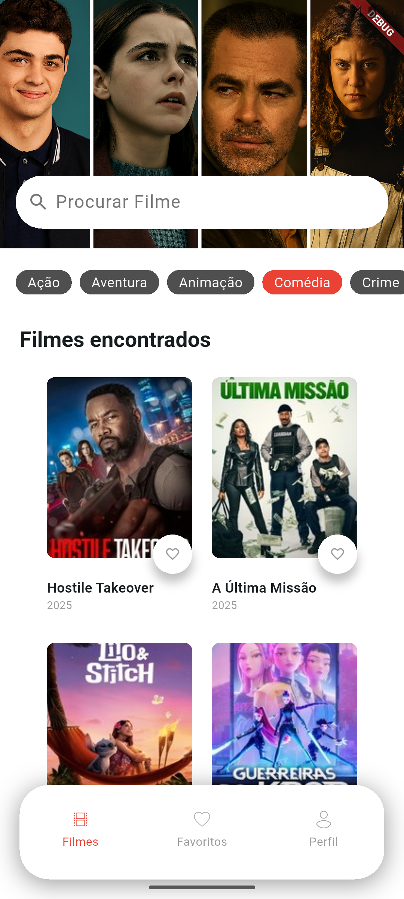

# Cinebox

## Description

This is a project developed during the **Flutter Experience: Cinebox** event by [Academia do Flutter](https://academiadoflutter.com.br/), in collaboration with professor [Rodrigo Rahman](https://github.com/rodrigorahman). The Cinebox app allows users to explore a list of movies, mark them as favorites, and filter them by category. The project was developed following the best practices and architecture recommended by the Flutter team, ensuring clean, scalable, and easily maintainable code.

## Screenshots

|                    Login                    |                   Home                    |                       Movie Details                        |
| :-----------------------------------------: | :---------------------------------------: | :--------------------------------------------------------: |
|  |  |  |

|                     Favorites                      |                     Profile                     |                             Movies by Category                             |
| :------------------------------------------------: | :---------------------------------------------: | :------------------------------------------------------------------------: |
|  |  |  |

## Architecture

The project's architecture follows the official Flutter guidelines, using a layer-based approach with **Services** and **Repositories** for the separation of concerns. The following packages and concepts were used:

- **Dio and Retrofit:** For communication with the The Movie Database (TMDb) REST API and with the custom backend for favorite management.
- **Riverpod:** For state management and dependency injection.
- **build_runner and build_generator:** For automatic code generation, speeding up development.
- **Command Design Pattern:** For executing actions in a decoupled manner.
- **ViewModel:** For separating the presentation logic from the UI.
- **SOLID Principles:** For creating more robust and maintainable code.

During their participation in the journey, it has developed a complete application in Flutter, using practical and advanced concepts based on the official guidelines from Google, in addition to applying good mobile development practices.

Throughout the workshop, the following topics were covered:

- Creation of a complete application using Flutter
- Application of the official architecture recommended by Google
- State management and dependency injection with Riverpod
- Integration with REST APIs using Retrofit
- Implementation of authentication with Google Sign-In
- Consumption of data from The Movie Database (TMDb) API
- Integration with a custom backend for favorite management
- Best practices for structuring and organizing Flutter projects.

## Credits

- **Academia do Flutter:** For the initiative and high-quality content.
- **Rodrigo Rahman:** For the mentoring and knowledge shared during the event.
